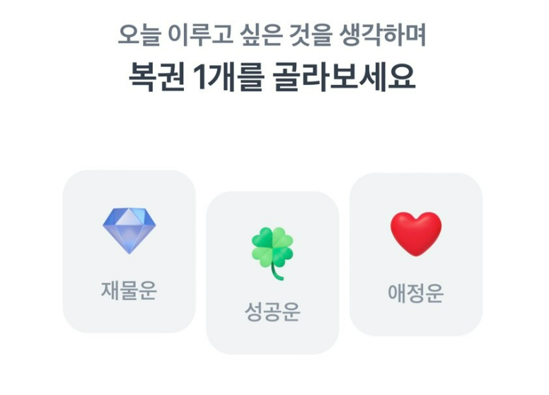
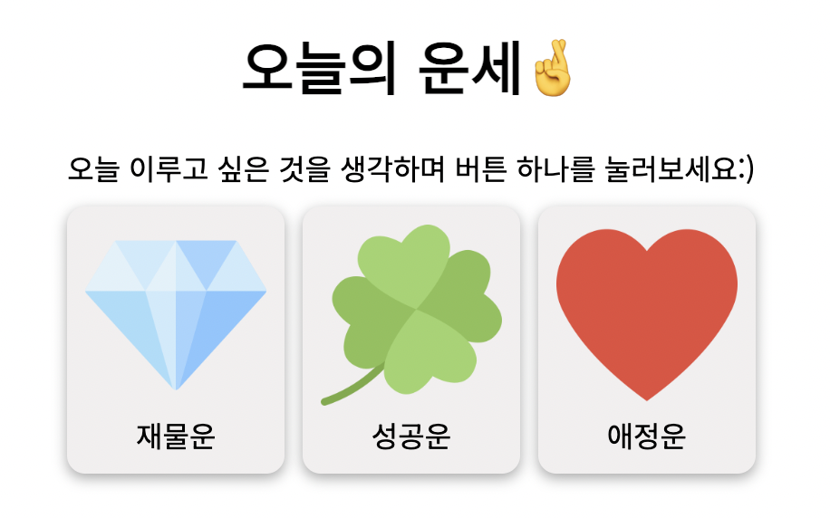

주제 : HTML, CSS, JS를 활용한 `쓸모 없는 웹 사이트` 개발

# 오늘의 운세(Today's fortune)🤞 by 김남혁, 문지환, 박재현1, 조명하


# 1. 프로젝트 및 팀(팀원) 소개

### 김남혁, 문지환, 박재현1, 조명하

## 후보 아이디어

- 오늘의 운세 ✔ (랜덤)
- 토끼와 거북이 경주 프로그램
- 고양이 입 열고 닫기

> 토스의 행운 복권을 오마주했습니다:)
>
> |  |  |
> | -------------------------------- | ------------------------------- |

# 2. 협업 방식

- 주제 및 요구사항 정리
- 시간(50분)을 정해 두고 각자 개발
- 진행상황과 막힌 점을 공유한 후 코드 합치기
- 반복

> 직접 코드를 작성하고 그에 따른 실행 결과를 확인하지 않고 역할을 분담하여 일부분만 개발하면 학습한 내용을 체화할 수 없기 때문!

# 3. 기능 시연

요구사항

- 재물운, 성공운, 애정운 3개의 이미지를 포함한 버튼
- 버튼 하나 클릭 시 아래 부분에 운세에 대한 정보 보여 주기
- 운세가 마음에 들지 않을 경우 누르는 버튼

# 4. 핵심 기능 설명 및 구현 방법

- [버튼 클릭 이벤트](#4.1-버튼-클릭-이벤트)
- [랜덤으로 점수와 초성 얻기](#4.2-랜덤으로-점수와-초성-얻기)
- [정해 둔 범위에 따라 점수를 문자열로 변환](#4.3-정해-둔-범위에-따라-점수를-문자열로-변환)
- [화면에 결과값 보여주기](#4.4-화면에-결과값-보여주기)
- [나와있는 결과창 맘에 안들면 누르는 버튼](#4.5-버튼-클릭시-상위의-제목-제외하고-제거)

## 4.0 미리 입력해 둔 데이터

### 점수에 따른 운세

| 점 수    | 이 름    |
| -------- | -------- |
| 0~9점    | 매우나쁨 |
| 10~29점  | 나 쁨    |
| 30~69점  | 보 통    |
| 70~89점  | 좋 음    |
| 90~100점 | 매우좋음 |

## 4.1 버튼 클릭 이벤트

사용자가 버튼을 클릭하면?

### 운세 점수

1. `getFortunePoint`: 랜덤으로 0~100 사이의 숫자를 만들기

- `Math.floor()`, `Math.random()`

2. `fortunePointToText` : 숫자를 문자열로 매핑하기

3. `buttonClickHandler`: 화면에 보여주기

### 버튼

1. 모든 버튼 비활성화(한 번에 하나의 운세만 확인 가능하도록)

```javascript
const buttonList = [moneyButton, successButton, loveButton];

buttonList.forEach((button) => {
  button.disabled = true;
});
```

2. 사용자가 클릭하지 않은 버튼은 화면에서 지우기

```javascript
const others = buttonList.filter((button) => button.id !== target);

others.forEach((otherButton) => {
  otherButton.style.display = 'none';
});
```

### 행운을 가져다줄 귀인

1. names 중에서 랜덤으로 하나의 초성을 고르기
2. 화면에 보여주기

## 4.2 이모지 변경

사용자가 이모지 위에 마우스를 이동하면

- ✌로 변경

사용자가 이모지 밖으로 마우스를 이동하면

- 🤞로 변경

## 4.3 이미지 확대

사용자가 이미지 위로 마우스를 이동하면

- 이미지 10% 확대

사용자가 이미지 밖으로 마우스를 이동하면

- 이미지 원래 크기로 변경

## 4.4 맘에 안들경우의 누르는 버튼

- 누를 경우 해당 버튼이 있는 태그를 포함하여 결과값을 전부 `display: 'none'`처리
- 해당 버튼은 눈에 잘보이게 하기 위해 깜빡이는 효과 추가
- 누른 이후로는 숨겨져 있던 문구를 `display: inline-block` 처리함으로서 드러나게 구현
- 해당 문구는 `@keyframe`의 `bounce`를 통해 글자가 부각되게함

## 4.5 행운의 색

```javascript
function randomColorSelector() {
  const colorCode = [
    'white',
    'black',
    'gray',
    'red',
    'orange',
    'yellow',
    'green',
    'blue',
    'navy',
    'purple',
    'violet',
    'olive',
    'skyblue',
    'lime',
    'beige',
    'brown',
    'ivory',
    'khaki',
    'pink',
  ];
  const randomColor = Math.floor(Math.random() * 19);
  return colorCode[randomColor];
}

const setLuckyColor = () => {
  const colorValue = randomColorSelector();

  color.style.backgroundColor = colorValue;
  colorName.innerText = colorValue.toUpperCase();

  result.style.display = 'flex';
  luckyColor.style.width = 'fit-content';
};
```

randomColorSelector 함수로 랜덤한 색상을 colorCode 배열에서 뽑아온 후
해당 색을 테이블에 적용시키고 대문자로 변경하여 작성함

# 5. 트러블 슈팅

## 5.1 버튼 안 눌렀는데도 이벤트 실행?

```javascript
// before
const buttonClickHandler = (target) => {
  setFortuneResult(target);
};

moneyButton.addEventListener('click', buttonClickHandler('money-button'));
```

### 해결책 1. 여러 개의 화살표 함수 : 다른 함수를 리턴

```javascript
// after
const buttonClickHandler = (target) => () => setFortuneResult(target);

// same as
const buttonClickHandler = (target) => {
  // outer function
  () => {
    // inner function
    setFortuneResult(target);
  };
};

moneyButton.addEventListener('click', buttonClickHandler('money-button'));
```

### 해결책 2. id값으로 버튼 특정하기

```javascript
// after
const buttonClickHandler = (event) => {
  const target = event.currentTarget.id;
  setFortuneResult(target);
};

moneyButton.addEventListener('click', buttonClickHandler);
```

## 5.2 애니메이션 효과중 원하는 값만 가져오는 것이 힘들었던 문제

여러 자료를 찾아본 뒤 중복되는 부분에 대해서 확인하고 원하는 부분만 확인 후 갖고 와서 적용을 하였습니다.

그리고 덕분에 필요한 부분이 일부분일 경우에는 import를 통해서 사용을 하게 되었습니다.

## 5.3 행운의 색을 어떻게 가져올 것인지

fliper 페이지처럼 랜덤한 값으로 하려 했으나 어떤 색인지 이름을 보여주기 힘들다고 생각함

css에서 기본적으로 제공하는 색상명 중 우리 주변에서 흔히 사용하는 색 위주로 몇개를 추려 배열을 만들고 해당 배열에서 랜덤으로 추출함

# 6. 회고(느낀점) - 팀원 전부 각자 느낀점

## @김남혁

- 숙련되지 않았고 어떤 기능들이 있는지 잘 알지 못하여 속도가 느렸으나, 반복 숙달하면 개선될 것 같았습니다. 팀원 분들이 이런 기능을 구현하기 위해 어떤 식으로 코드를 짰다고 설명하셨는데, 코드를 짜기 전에 어떤 식으로 로직을 생각해야 할지 감이 잡혔습니다.

## @문지환

- 부담없이 가벼운 주제로 할 수 있어 좋았습니다. 디자인을 어떻게 할지 팀원들과 이야기하는 등 시간을 가지면서 제가 부족하거나 잘못 알고있던 개념에 대해 다시 이해할 수 있는 시간을 가진 것 같습니다.

## @박재현1

- 코드를 짤때 여러가지를 고려하고 그를 토대로 짜려고 하다보니 초반에 늦게 구현하게 되는
  상황이 있었는데 조금 더 속도를 높여야 겠다고 느꼈고 기능에 대하여 부담없이 만들어서
  팀원들과 재밌게 만든 거 같습니다.

## @조명하

- 제어하고자 하는 태그를 하나하나 선언하는 코드, 사용하고자 하는 상수 데이터를 정의하는 코드가 간단한 프로젝트인데도 생각보다 길었다.
- 간단한 프로젝트라 각자 만들어도 잘 합칠 수 있을 줄 알았는데 서로의 기능을 유지하고, 스타일 유지하면서 코드를 합치는 게 어려웠다.
